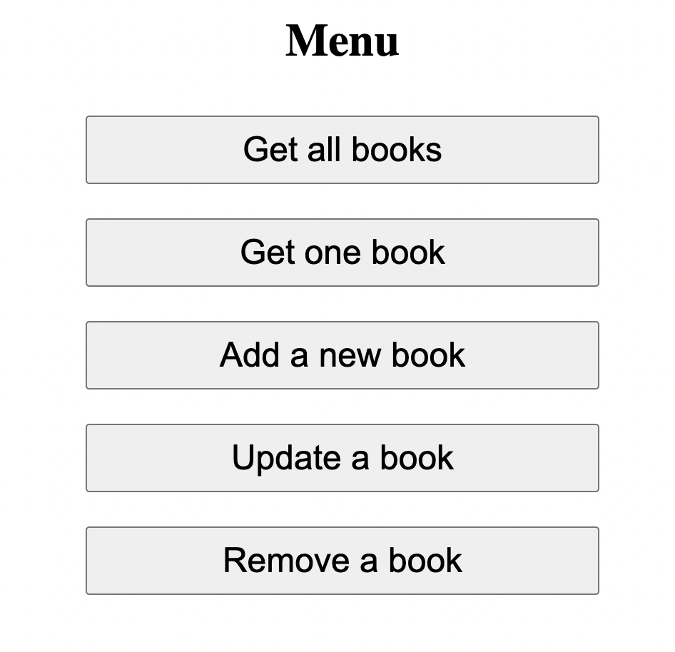

# Node / Express application for books

- A CRUD (create, read, update, delete) application for books made with Node / Express as a final course assignment @ Business College Helsinki.

## Technologies and tools

- Node.js
- Express.js
- EJS

## Usage

- Get the project to your local computer i.e. by cloning or forking and check the package.json file for dependecies and install those dependencies.

- To run the application, navigate to the root folder of the project and run the below code from a terminal of your choice.

```shell
node index.js
```

- Then open your browser and go to [http://localhost:3000](http://localhost:3000).

## Screenshot of menu page

